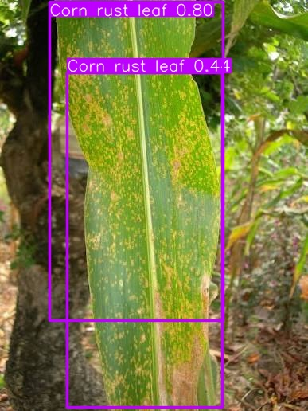
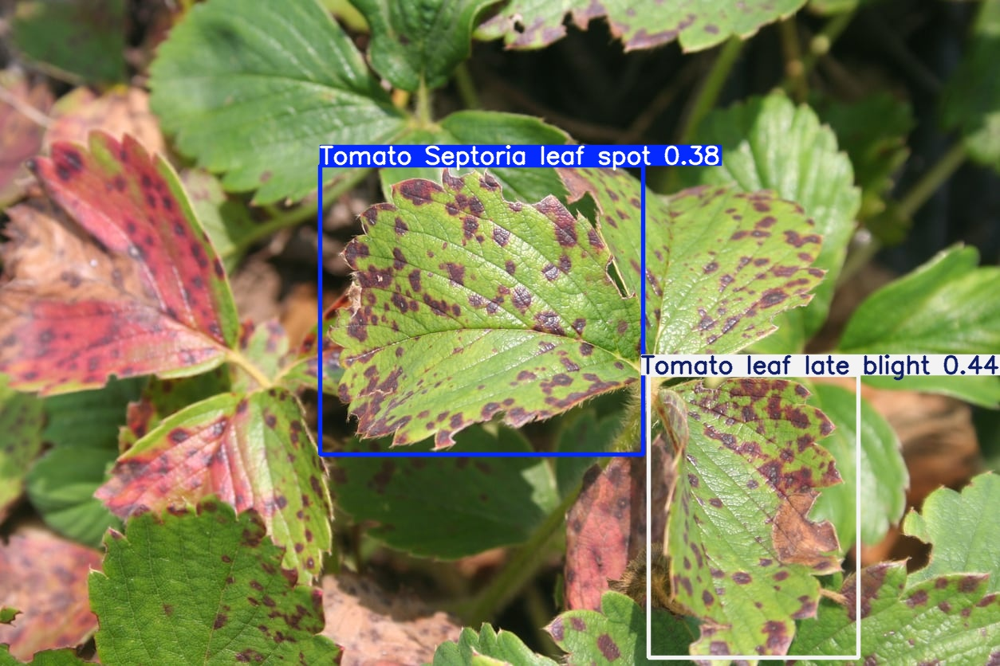

# Diseases detection in plant leaves using YOLO Object Detection

## 📖 Overview 
In Agriculture we observe that pests and plant diseases cause a lot of losses which also affects the overall yield, to deal with this we are working on a YOLO based diseases detection system which will help in flagging the onset of  pests and diseases so that they can be treated early, thus saving the plants and promoting them to grow freely which will then give us the expected yield per plant while also saving the farmers a lot of money.

## ✨ Features
- Helps detect the diseased part of the plant 
- The YOLO's detection system will also show the part of the plant which is diseased through bounding boxes
- It flags the type of diseases that attacked the plant

## 🛠️ Technologies Used
1. Python 3.14
2. YOLO 8n (Nano model)

## 📊 Dataset
In this we used a small plant diseases dataset [**PlantDoc**](https://www.kaggle.com/datasets/andresmgs/plantdec) from Kaggle which contained about 2,569 images of plants diseases. It is a pre made dataset which was made for YOLO training.
It had 13 Plant species with 30 classes.

## 🚀 How to Run
Download The folders and run the commands in the included colab file to use the model. To predict for your own images, just mention its path in the model prediction command and run it, the results will stored in the path `\content\run\detect\predict` as an image with the bounding boxes.

## 📈 Results
The model is performing at a confidence rate between 0.5 to 0.8 across the plant species in the dataset. The accuracy can be increased by having a more bigger dataset and also opting for a more capable model than the nano one used here.
1. Predictions
	
	
	

## 👨‍💻 Author
Bhavan Adhityan J
2026
